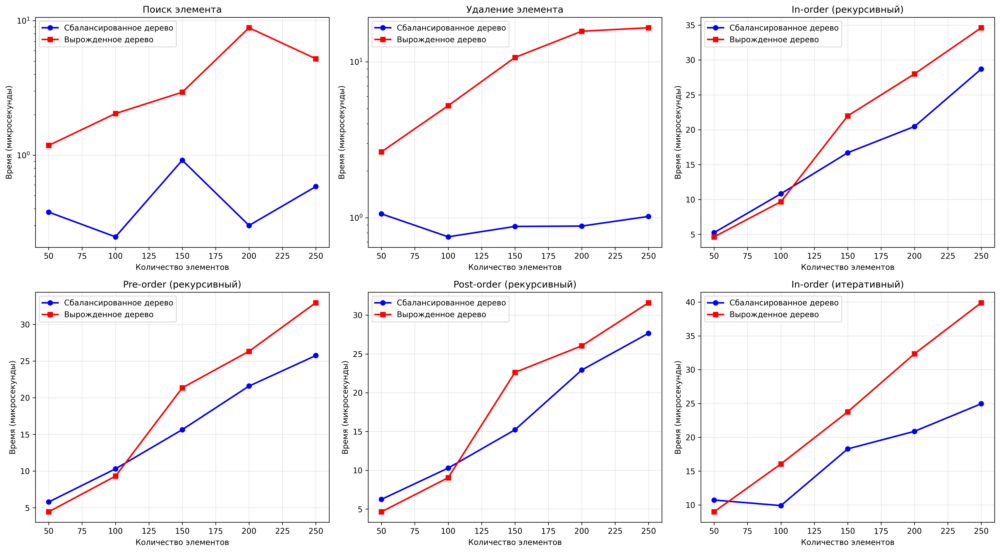

## Отчет к лабораторной работе № 6   

---
**Дата:** 2025-11-03  
**Семестр:** 3 курс 1 полугодие - 5 семестр  
**Группа:** ПИЖ-б-о-23-1  
**Дисциплина:** Анализ сложности алгоритмов   
**Студентка:** Журавлева Софья Витальевна   
**Репозиторий Git:** https://github.com/lookitsssonya/ZhuravlevaSV 

---
## Цель работы:
Изучить древовидные структуры данных, их свойства и применение. Освоить основные
операции с бинарными деревьями поиска (BST). Получить практические навыки реализации BST на
основе узлов (pointer-based), рекурсивных алгоритмов обхода и анализа их эффективности.
Исследовать влияние сбалансированности дерева на производительность операций.

---
## Теория (кратко):  
**Дерево:** Рекурсивная структура данных, состоящая из узлов, где каждый узел имеет значение и
 ссылки на дочерние узлы.   
**Бинарное дерево поиска (BST):** Дерево, для которого выполняются следующие условия:
* Значение в левом поддереве любого узла меньше значения в самом узле.
* Значение в правом поддереве любого узла больше значения в самом узле.
* Оба поддерева являются бинарными деревьями поиска.

**Основные операции BST:** 
* **Вставка (Insert):** Сложность: в среднем O(log n), в худшем (вырожденное дерево) O(n).   
* **Поиск (Search):** Сложность: в среднем O(log n), в худшем O(n).   
* **Удаление (Delete):** Сложность: в среднем O(log n), в худшем O(n). Имеет три случая:
удаление листа, узла с одним потомком, узла с двумя потомками.   
* **Обход (Traversal):**   
  * **In-order (левый-корень-правый):** Посещает узлы в порядке возрастания. Сложность O(n).
  * **Pre-order (корень-левый-правый):** Полезен для копирования структуры дерева. Сложность O(n).
  * **Post-order (левый-правый-корень):** Полезен для удаления дерева. Сложность O(n).   

**Сбалансированные деревья:** Деревья с контролем высоты (например, AVL, Красно-черные),
которые гарантируют время операций O(log n) даже в худшем случае.      
---
## Практическая часть
### Выполненные задачи:
1. Реализовано бинарное дерево поиска на основе узлов с основными операциями.
2. Реализованы различные методы обхода дерева (рекурсивные и итеративные).
3. Реализованы дополнительные методы для работы с BST.
4. Проведен анализ сложности операций для сбалансированного и вырожденного деревьев.
5. Визуализирована структуру дерева.   
---
### Ключевые фрагменты кода <br></br>
Поиск значения в дереве:       
*binary_search_tree.py:*   
```python
def search(self, value: int) -> bool:
    current = self.root

    while current is not None:
        if value == current.value:
            return True
        elif value < current.value:
            current = current.left
        else:
            current = current.right

    return False
```
---
Удаление значения из дерева:   
*binary_search_tree.py:*
```python
def delete(self, value: int) -> None:
    self.root = self._delete_recursive(self.root, value)

def _delete_recursive(self, node: Optional[TreeNode], value: int) -> Optional[TreeNode]:
    if node is None:
        return None

    if value < node.value:
        node.left = self._delete_recursive(node.left, value)
    elif value > node.value:
        node.right = self._delete_recursive(node.right, value)
    else:
        if node.left is None:
            return node.right
        elif node.right is None:
            return node.left

        min_node = self._find_min(node.right)
        node.value = min_node.value
        node.right = self._delete_recursive(node.right, min_node.value)

    return node
```
---
Рекурсивный in-order обход:   
*tree_traversal.py:*
```python
def inorder_recursive(node: Optional[TreeNode], result: List[int]) -> None:
    if node is not None:
        inorder_recursive(node.left, result)
        result.append(node.value)
        inorder_recursive(node.right, result)
```
---
Рекурсивный pre-order обход:    
*tree_traversal.py:*
```python
def preorder_recursive(node: Optional[TreeNode], result: List[int]) -> None:
    if node is not None:
        result.append(node.value)
        preorder_recursive(node.left, result)
        preorder_recursive(node.right, result)
```
---
Рекурсивный post-order обход:   
*tree_traversal.py:*
```python
def postorder_recursive(node: Optional[TreeNode], result: List[int]) -> None:
    if node is not None:
        postorder_recursive(node.left, result)
        postorder_recursive(node.right, result)
        result.append(node.value)
```
---
Итеративный in-order обход:   
*tree_traversal.py:*
```python
def inorder_iterative(root: Optional[TreeNode]) -> List[int]:
    result: List[int] = []
    stack: List[TreeNode] = []
    current: Optional[TreeNode] = root

    while current is not None or stack:
        while current is not None:
            stack.append(current)
            current = current.left

        current = stack.pop()
        result.append(current.value)
        current = current.right

    return result
```
---
## Результаты выполнения

### Пример работы программы
```bash
ХАРАКТЕРИСТИКИ ПК ДЛЯ ТЕСТИРОВАНИЯ:
- Процессор: Intel Core i5-13420H (2.10 GHz)
- Оперативная память: 16 GB DDR5
- ОС: Windows 11
- Python: 3.11

Значения: [50, 30, 70, 20, 40, 60, 80, 10, 25, 35, 45]
Минимальное значение: 10
Максимальное значение: 80
Высота дерева: 4
Корректное BST: True

Скобочное представление:
(50(30(20(10)(25))(40(35)(45)))(70(60)(80)))

Структура дерева:
       50
      ╻━┻━╻
   30       70
  ╻━┻━╻    ╻━┻━╻
 20   40   60   80
╻━┻━╻╻━┻━╻
10 25 35 45

Результаты обходов:
In-order: [10, 20, 25, 30, 35, 40, 45, 50, 60, 70, 80]
Pre-order: [50, 30, 20, 10, 25, 40, 35, 45, 70, 60, 80]
Post-order: [10, 25, 20, 35, 45, 40, 30, 60, 80, 70, 50]
In-order (итеративный): [10, 20, 25, 30, 35, 40, 45, 50, 60, 70, 80]

Поиск элементов:
Поиск 25: найден
Поиск 55: не найден
Поиск 70: найден
Поиск 100: не найден

Удаление элемента:
Удаляемый элемент 25
Минимальное значение: 10
Максимальное значение: 80
Высота дерева: 4
Корректное BST: True

Скобочное представление:
(50(30(20(10)())(40(35)(45)))(70(60)(80)))

Структура дерева:
       50
      ╻━┻━╻
   30       70
  ╻━┻━╻    ╻━┻━╻
 20   40   60   80
╻━╹  ╻━┻━╻
10    35 45
Удаляемый элемент 70
Минимальное значение: 10
Максимальное значение: 80
Высота дерева: 4
Корректное BST: True

Скобочное представление:
(50(30(20(10)())(40(35)(45)))(80(60)()))

Структура дерева:
       50
      ╻━┻━╻
   30       80
  ╻━┻━╻    ╻━╹
 20   40   60
╻━╹  ╻━┻━╻
10    35 45

Демонстрация разных типов деревьев

1. Сбалансированное дерево:
Минимальное значение: 5
Максимальное значение: 70
Высота дерева: 4
Корректное BST: True

Скобочное представление:
(40(20(10(5)(15))(30(25)(35)))(60(50)(70)))

Структура дерева:
       40
      ╻━┻━╻
   20       60
  ╻━┻━╻    ╻━┻━╻
 10   30   50   70
╻━┻━╻╻━┻━╻
 5 15 25 35

2. Вырожденное дерево:
Минимальное значение: 10
Максимальное значение: 70
Высота дерева: 7
Корректное BST: True

Скобочное представление:
(10()(20()(30()(40()(50()(60()(70)))))))

Структура дерева:
10 → 20 → 30 → 40 → 50 → 60 → 70
Вырожденное дерево (правая ветвь)

Анализ производительности
Анализ для размера 50
  Сбалансированное: время=0.000000с, высота=13
  Вырожденное: время=0.000001с, высота=50
Анализ для размера 100
  Сбалансированное: время=0.000000с, высота=13
  Вырожденное: время=0.000002с, высота=100
Анализ для размера 150
  Сбалансированное: время=0.000000с, высота=12
  Вырожденное: время=0.000003с, высота=150
Анализ для размера 200
  Сбалансированное: время=0.000000с, высота=15
  Вырожденное: время=0.000005с, высота=200
Анализ для размера 250
  Сбалансированное: время=0.000000с, высота=18
  Вырожденное: время=0.000005с, высота=250

Выводы:
1. Сбалансированные деревья показывают производительность O(log n) для поиска и удаления
2. Вырожденные деревья деградируют до O(n) для поиска и удаления
3. Все обходы имеют сложность O(n) независимо от структуры дерева
4. Итеративный обход обычно быстрее рекурсивных из-за отсутствия накладных расходов на вызовы функций
```
---
## Выводы
1. Сбалансированные деревья демонстрируют логарифмическую сложность O(log n) для операций поиска и удаления, в то время
как вырожденные деревья деградируют до линейной сложности O(n). Это подтверждает теоретическое ожидание, что сбалансированность 
дерева является критическим фактором для эффективности основных операций BST. На практике разница в производительности
становится особенно заметной при больших размерах деревьев (сотни элементов), где вырожденные деревья могут быть в десятки 
раз медленнее.

2. Все виды обходов дерева (in-order, pre-order, post-order) имеют линейную сложность O(n) независимо от структуры дерева.
Это объясняется тем, что при любом обходе необходимо посетить каждый узел ровно один раз. При этом итеративный in-order
обход показал чуть более лучшую производительность по сравнению с рекурсивными подходами благодаря отсутствию накладных 
расходов на вызовы функций и работе со стеком вызовов.   
---
## Ответы на контрольные вопросы
1. **Сформулируйте основное свойство бинарного дерева поиска (BST).**   

Для каждой вершины дерева, значение всех вершин в левом поддереве меньше значения данной вершины, а значение всех вершин
в правом поддереве – больше значения данной вершины.   

---
2. **Опишите алгоритм вставки нового элемента в BST. Какова сложность этой операции в сбалансированном и вырожденном дереве?**   

* Начинаем с корня дерева.
* Сравниваем значение нового элемента со значением текущей вершины.
* Если значение нового элемента меньше значения текущей вершины, переходим в левое поддерево.
* Если значение нового элемента больше значения текущей вершины, переходим в правое поддерево.
* Повторяем шаги 2-4, пока не достигнем NULL (пустой ссылки), что означает, что мы нашли место для вставки нового элемента.
* Создаем новый узел с данным значением и вставляем его на место NULL.   

Сложность:   
В сбалансированном дереве: O(log n), где n – количество узлов в дереве.   
В вырожденном дереве: O(n), где n – количество узлов в дереве.      

---
3. **Чем отличается обход дерева в глубину (DFS) от обхода в ширину (BFS)? Назовите виды DFS обходов и их особенности?**   

DFS исследует дерево по ветвям, продвигаясь как можно глубже по каждой ветви, прежде чем перейти к следующей. BFS исследует
дерево уровень за уровнем, обходя все узлы на текущем уровне, прежде чем перейти к следующему уровню.    
Виды DFS обходов и их особенности:
* In-order (Левый-Корень-Правый). Обходит левое поддерево, затем корень, затем правое поддерево. Для BST выдаёт узлы
в отсортированном порядке.
 Pre-order (Корень-Левый-Правый). Обходит корень, затем левое поддерево, затем правое поддерево. Полезен для создания
копии дерева.
* Post-order (Левый-Правый-Корень). Обходит левое поддерево, затем правое поддерево, затем корень. Полезен для удаления
дерева или вычисления выражений.   
---
4. **Почему в вырожденном BST (например, когда элементы добавляются в отсортированном порядке) сложность операций поиска
и вставки становится O(n)?**    

В вырожденном BST (например, когда элементы добавляются в отсортированном порядке) дерево превращается в связный список.
В этом случае для поиска или вставки элемента необходимо пройти по всем узлам, что занимает O(n) времени.    

---
5. **Что такое сбалансированное дерево (например, AVL-дерево) и как оно решает проблему вырождения BST?**  

Сбалансированное дерево (например, AVL-дерево) – это дерево, в котором высота левого и правого поддерева каждой вершины
отличается не более чем на константу. Это достигается путем выполнения операций балансировки (например, поворотов) при
вставке или удалении узлов. Благодаря этому высота дерева остается O(log n), что гарантирует, что сложность операций
поиска и вставки будет O(log n), даже в худшем случае. AVL-дерево – пример самобалансирующегося дерева.   

---
## Приложение


