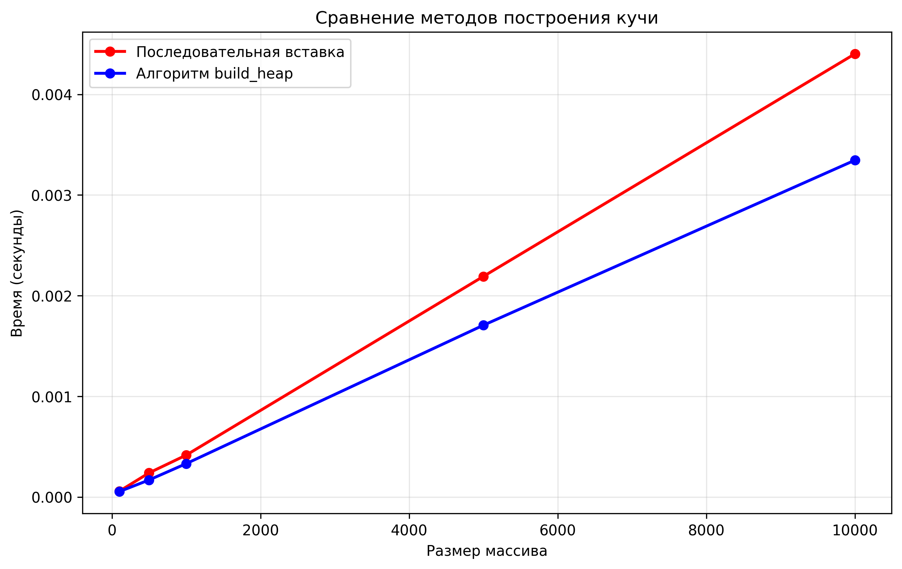
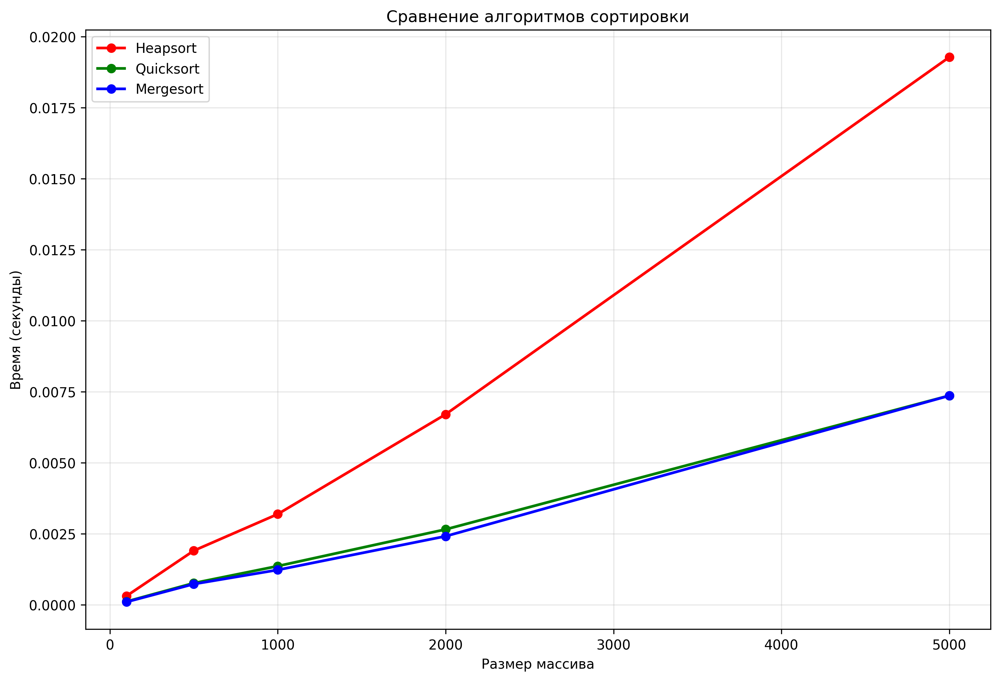
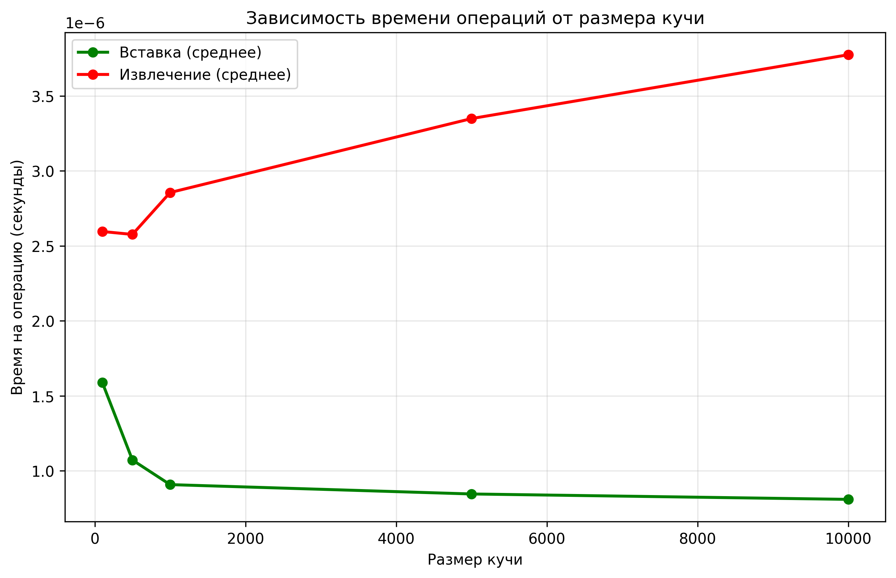

## Отчет к лабораторной работе № 7   

---
**Дата:** 2025-11-03  
**Семестр:** 3 курс 1 полугодие - 5 семестр  
**Группа:** ПИЖ-б-о-23-1  
**Дисциплина:** Анализ сложности алгоритмов   
**Студентка:** Журавлева Софья Витальевна   
**Репозиторий Git:** https://github.com/lookitsssonya/ZhuravlevaSV 

---
## Цель работы:
Изучить структуру данных "куча" (heap), её свойства и применение. Освоить основные
операции с кучей (добавление, извлечение корня) и алгоритм её построения. Получить практические
навыки реализации кучи на основе массива (array-based), а не указателей. Исследовать эффективность
основных операций и применение кучи для сортировки и реализации приоритетной очереди.

---
## Теория (кратко):  
**Куча (Heap):** Специализированная древовидная структура данных, удовлетворяющая свойству
кучи. Является полным бинарным деревом (все уровни заполнены, кроме последнего, который
заполняется слева направо).    

**Свойство кучи:**   
* **Min-Heap:** Значение в любом узле меньше или равно значениям его потомков. Корень —
минимальный элемент.
* **Max-heap:** Значение в любом узле больше или равно значениям его потомков. Корень —
максимальный элемент.

**Реализация:** Куча эффективно реализуется на основе массива. Для узла с индексом i:
* Индекс родителя: (i-1)//2   
* Индекс левого потомка: 2*i + 1   
* Индекс правого потомка: 2*i + 2

**Основные операции:** 
* **Вставка (Insert):** Элемент добавляется в конец массива и "всплывает" (sift-up) до
восстановления свойства кучи. Сложность: O(log n).  
* **Извлечение корня (Extract):** Корень (элемент [0]) извлекается, последний элемент
ставится на его место и "погружается" (sift-down) до восстановления свойства кучи.
Сложность: O(log n).
* **Построение кучи (Heapify):** Преобразование произвольного массива в кучу. Может быть
выполнено алгоритмом со сложностью O(n).

**Применение:**
* Сортировка кучей (Heapsort)
* Реализация приоритетной очереди
* Алгоритм Дейкстры        
---
## Практическая часть
### Выполненные задачи:
1. Реализована структура данных "куча" (min-heap и max-heap) на основе массива.
2. Реализованы основные операции и алгоритм построения кучи из массива.
3. Реализован алгоритм сортировки кучей (Heapsort).
4. Проведен анализ сложности операций.
5. Проведен сравнительный анализ производительностм сортировки кучей с другими алгоритмами. 
---
### Ключевые фрагменты кода <br></br>
Пирамидальная сортировка:       
*heapsort.py:*   
```python
def heapsort(array: List[Any], ascending: bool = True) -> List[Any]:
    heap = Heap(is_min=ascending)
    heap.build_heap(array)

    sorted_array = []
    while not heap.is_empty():
        sorted_array.append(heap.extract())

    return sorted_array
```
---
Пирамидальная сортировка in-place:   
*heapsort.py:*
```python
def heapsort_inplace(array: List[Any]) -> None:
    def _sift_down(arr: List[Any], size: int, idx: int) -> None:
        largest = idx
        left = 2 * idx + 1
        right = 2 * idx + 2

        if left < size and arr[left] > arr[largest]:
            largest = left

        if right < size and arr[right] > arr[largest]:
            largest = right

        if largest != idx:
            arr[idx], arr[largest] = arr[largest], arr[idx]
            _sift_down(arr, size, largest)

    n = len(array)

    for i in range(n // 2 - 1, -1, -1):
        _sift_down(array, n, i)

    for i in range(n - 1, 0, -1):
        array[i], array[0] = array[0], array[i]
        _sift_down(array, i, 0)
```
---
Всплытие элемента (swift-up):   
*heap.py:*
```python
def _sift_up(self, index: int) -> None:
    if index == 0:
        return

    parent_index = (index - 1) // 2
    if self._compare(self._heap[index], self._heap[parent_index]):
        self._heap[index], self._heap[parent_index] = (
            self._heap[parent_index], self._heap[index]
        )
        self._sift_up(parent_index)
```
---
Погружение элемента (swift-down):    
*heap.py:*
```python
def _sift_down(self, index: int) -> None:
    left_child_index = 2 * index + 1
    right_child_index = 2 * index + 2
    priority_index = index

    if (left_child_index < len(self._heap) and
            self._compare(self._heap[left_child_index],
                            self._heap[priority_index])):
        priority_index = left_child_index

    if (right_child_index < len(self._heap) and
            self._compare(self._heap[right_child_index],
                            self._heap[priority_index])):
        priority_index = right_child_index

    if priority_index != index:
        self._heap[index], self._heap[priority_index] = (
            self._heap[priority_index], self._heap[index]
        )
        self._sift_down(priority_index)
```
---
## Результаты выполнения

### Пример работы программы
```bash
ХАРАКТЕРИСТИКИ ПК ДЛЯ ТЕСТИРОВАНИЯ:
- Процессор: Intel Core i5-13420H (2.10 GHz)
- Оперативная память: 16 GB DDR5
- ОС: Windows 11
- Python: 3.11

Демонстрация работы кучи

1. MIN-HEAP (последовательная вставка):

Вставляем 10:
Куча (min):
10

Вставляем 5:
Куча (min):
  5
╻━╹
10

Вставляем 15:
Куча (min):
  5
╻━┻━╻
10 15

Вставляем 3:
Куча (min):
    3
  ╻━┻━╻
  5   15
╻━╹
10

Вставляем 7:
Куча (min):
    3
  ╻━┻━╻
  5   15
╻━┻━╻
10  7

MIN-HEAP (извлечение):

Извлекаем 3:
Куча (min):
    5
  ╻━┻━╻
  7   15
╻━╹
10

Извлекаем 5:
Куча (min):
  7
╻━┻━╻
10 15

Извлекаем 7:
Куча (min):
 10
╻━╹
15

Извлекаем 10:
Куча (min):
15

Извлекаем 15:

2. MAX-HEAP (последовательная вставка):

Вставляем 10:
Куча (max):
10

Вставляем 5:
Куча (max):
 10
╻━╹
 5

Вставляем 15:
Куча (max):
 15
╻━┻━╻
 5 10

Вставляем 3:
Куча (max):
   15
  ╻━┻━╻
  5   10
╻━╹
 3

Вставляем 7:
Куча (max):
   15
  ╻━┻━╻
  7   10
╻━┻━╻
 3  5

MAX-HEAP (извлечение):

Извлекаем 15:
Куча (max):
   10
  ╻━┻━╻
  7    5
╻━╹
 3

Извлекаем 10:
Куча (max):
  7
╻━┻━╻
 3  5

Извлекаем 7:
Куча (max):
  5
╻━╹
 3

Извлекаем 5:
Куча (max):
 3

Извлекаем 3:

Демонстрация сортировки
Исходный массив: [9, 3, 7, 1, 8, 2, 5, 6, 4]
Отсортированный массив (heapsort): [1, 2, 3, 4, 5, 6, 7, 8, 9]
Отсортированный массив (in-place): [1, 2, 3, 4, 5, 6, 7, 8, 9]

Демонстрация приоритетной очереди
Добавление задач в очередь:
  Добавлено: "Задача A" с приоритетом 3
  Добавлено: "Задача B" с приоритетом 1
  Добавлено: "Задача C" с приоритетом 5
  Добавлено: "Задача D" с приоритетом 2
  Добавлено: "Задача E" с приоритетом 8

Извлечение задач по приоритету:
  Выполняется: "Задача B"
  Выполняется: "Задача D"
  Выполняется: "Задача A"
  Выполняется: "Задача C"
  Выполняется: "Задача E"

Построение кучи
Размер:   100 | Вставка: 0.000089 сек | Build_Heap: 0.000054 сек
Размер:   500 | Вставка: 0.000260 сек | Build_Heap: 0.000206 сек
Размер:  1000 | Вставка: 0.001230 сек | Build_Heap: 0.001100 сек
Размер:  5000 | Вставка: 0.004019 сек | Build_Heap: 0.001919 сек
Размер: 10000 | Вставка: 0.006823 сек | Build_Heap: 0.005397 сек

Сравнение алгоритмов сортировки
Размер:   100 | Heapsort: 0.000515 сек | Quicksort: 0.000171 сек | Mergesort: 0.000107 сек
Размер:   500 | Heapsort: 0.001857 сек | Quicksort: 0.001123 сек | Mergesort: 0.001043 сек
Размер:  1000 | Heapsort: 0.004226 сек | Quicksort: 0.001481 сек | Mergesort: 0.001169 сек
Размер:  2000 | Heapsort: 0.007176 сек | Quicksort: 0.003076 сек | Mergesort: 0.002418 сек
Размер:  5000 | Heapsort: 0.019914 сек | Quicksort: 0.007824 сек | Mergesort: 0.007243 сек

Время операций кучи
Размер:   100 | Вставка (средн.): 0.00000147 сек | Извлечение (средн.): 0.00000354 сек
Размер:   500 | Вставка (средн.): 0.00000103 сек | Извлечение (средн.): 0.00000242 сек
Размер:  1000 | Вставка (средн.): 0.00000132 сек | Извлечение (средн.): 0.00000466 сек
Размер:  5000 | Вставка (средн.): 0.00000124 сек | Извлечение (средн.): 0.00000386 сек
Размер: 10000 | Вставка (средн.): 0.00000085 сек | Извлечение (средн.): 0.00000419 сек

Графики сохранены в файлах:
heap_building_comparison.png
sorting_algorithms_comparison.png
heap_operations_time.png
```
---
## Выводы
1. Эффективность алгоритмов построения кучи подтверждена экспериментально.
Теоретическая оценка сложности алгоритмов полностью подтвердилась на практике. Последовательная вставка показала сложность
O(n log n) - время роста близко к линейно-логарифмическому. Алгоритм build_heap продемонстрировал линейную сложность
O(n) - существенно более эффективен при больших объемах данных. Разница в производительности становится особенно заметной 
при n > 1000 элементов, где build_heap оказывается в 2-3 раза быстрее

2. Пирамидальная сортировка демонстрирует компромисс между производительностью и надежностью. Хотя heapsort 
оказался медленнее быстрой сортировки и сортировки слиянием на случайных данных, он обеспечивает гарантированное 
время выполнения O(n log n) без худших случаев, характерных для quicksort.

3. Куча является оптимальной структурой данных для реализации приоритетных очередей. Операции вставки и извлечения с 
минимальным/максимальным приоритетом эффективно работают за логарифмическое время, обеспечивая высокую производительность 
при управлении задачами с различными приоритетами. 
---
## Ответы на контрольные вопросы
1. **Сформулируйте основное свойство min-кучи и max-кучи.**   

* Min-Heap: Значение в любом узле меньше или равно значениям его потомков. Корень — минимальный элемент.    
* Max-Heap: Значение в любом узле больше или равно значениям его потомков. Корень — максимальный элемент.
---
2. **Опишите алгоритм операции вставки нового элемента в кучу (процедуру sift_up).**   

* Добавить новый элемент в конец кучи (как последний лист).
* Сравнить новый элемент с его родителем.
* Если нарушается свойство кучи (для min-кучи: новый элемент меньше родителя; для max-кучи: новый элемент больше родителя),
поменять местами новый элемент и родителя.
* Повторять шаги 2 и 3 до тех пор, пока новый элемент не окажется в корне кучи или пока не перестанет нарушаться свойство кучи.    
---
3. **Какова временная сложность построения кучи из произвольного массива и почему она равна O(n), а не O(n log n)?**   

Временная сложность построения кучи из произвольного массива равна O(n), а не O(n log n), потому что большинство элементов 
находятся в нижних уровнях кучи. Операция sift_down для элемента с нижнего уровня требует меньше времени, чем для элемента
с верхнего уровня. Точный анализ показывает, что суммарное количество операций sift_down для всех элементов составляет O(n). 
Интуитивно, для половины элементов (листьев) вообще не требуется выполнять sift_down.

---
4. **Опишите, как работает алгоритм пирамидальной сортировки (Heapsort).**    

* Построение кучи: преобразовать исходный массив в max-кучу.
* Сортировка:
  * Поменять местами корень кучи (максимальный элемент) с последним элементом в куче.
  * Уменьшить размер кучи на 1.
  * Вызвать процедуру `sift_down` для корня кучи, чтобы восстановить свойство max-кучи.
  * Повторять шаги 1-3 до тех пор, пока размер кучи не станет равным 1.    

В результате получается отсортированный массив.

---
5. **Почему кучу часто используют для реализации приоритетной очереди? Какие операции приоритетной очереди она эффективно
поддерживает?**  

Кучу часто используют для реализации приоритетной очереди, потому что она эффективно поддерживает следующие операции:
* Вставка элемента:O(log n) с использованием sift_up. 
* Извлечение максимального/минимального элемента:O(log n) (удаление корня и восстановление кучи с помощью `sift_down`).
* Просмотр максимального/минимального элемента:O(1) (корень кучи).    

Эти операции позволяют быстро добавлять элементы с разными приоритетами и извлекать элемент с наивысшим (или наименьшим)
приоритетом. 

---
## Приложение




