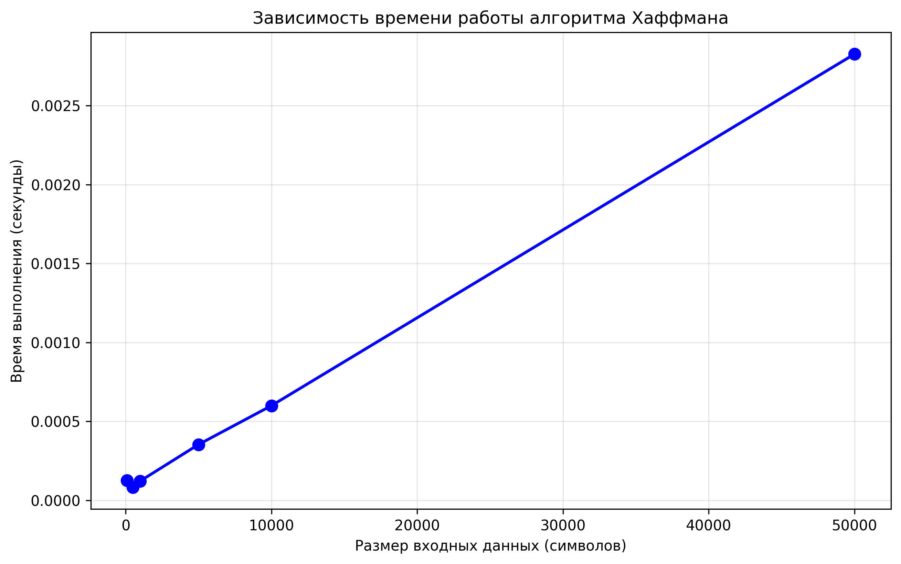
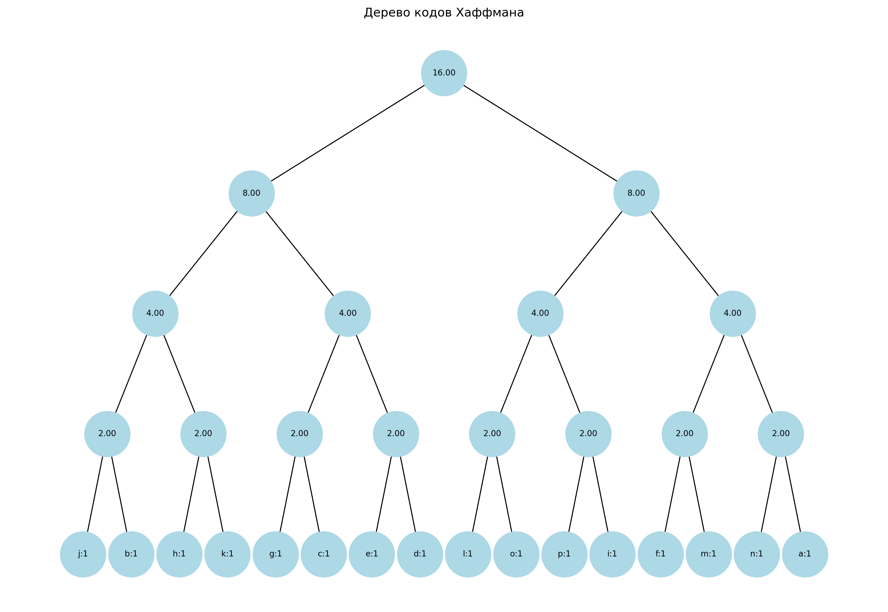

## Отчет к лабораторной работе № 8   

---
**Дата:** 2025-11-03  
**Семестр:** 3 курс 1 полугодие - 5 семестр  
**Группа:** ПИЖ-б-о-23-1  
**Дисциплина:** Анализ сложности алгоритмов   
**Студентка:** Журавлева Софья Витальевна   
**Репозиторий Git:** https://github.com/lookitsssonya/ZhuravlevaSV 
---
## Цель работы:
Изучить метод проектирования алгоритмов, известный как "жадный алгоритм". Освоить
принцип принятия локально оптимальных решений на каждом шаге и понять условия, при которых этот
подход приводит к глобально оптимальному решению. Получить практические навыки реализации
жадных алгоритмов для решения классических задач, анализа их корректности и оценки
эффективности.
---
## Теория (кратко):  
**Жадный алгоритм:**  Алгоритм, который на каждом шаге принимает локально оптимальное
решение в надежде, что итоговое решение будет глобально оптимальным.    

**Ключевые характеристики:**   
* **Жадный выбор:** На каждом шаге выбирается лучший из доступных вариантов в данный
момент, без учета последствий для будущих шагов.
* **Оптимальная структура:** Оптимальное решение задачи содержит в себе оптимальные
решения её подзадач.

**Области применения:** Жадные алгоритмы эффективны для задач, где выбор, сделанный на
каждом шаге, не ухудшает возможности достижения глобального оптимума. Они часто работают
быстро (полиномиальное время), но не всегда приводят к оптимальному решению.

**Классические задачи:** 
* **Задача о выборе заявок (Interval Scheduling):**  Выбор максимального количества
непересекающихся интервалов.  
* **Задача о рюкзаке (Непрерывная/Дробная):** Выбор предметов с максимальной
суммарной стоимостью, если можно брать части предметов.
* **Алгоритм Хаффмана:** Оптимальное префиксное кодирование для сжатия данных.
* **Построение минимального остовного дерева (Алгоритмы Прима и Краскала):** (Хотя
это и графовый алгоритм, он является классическим примером жадного подхода).   
---
## Практическая часть
### Выполненные задачи:
1. Реализованы классические жадные алгоритмы.
2. Проанализирована их корректность.
3. Проведен сравнительный анализ эффективности жадного подхода и других методов (например,
полного перебора для маленьких входных данных).
4. Решены практические задачи с применением жадного подхода.
---
### Ключевые фрагменты кода <br></br>
Алгоритм выбора интервалов:       
*greedy_algorithms.py:*   
```python
def select_intervals(
    intervals: List[Tuple[float, float]]
) -> List[Tuple[float, float]]:
    sorted_intervals = sorted(intervals, key=lambda x: x[1])

    selected: List[Tuple[float, float]] = []
    last_end: float = -float('inf')

    for interval in sorted_intervals:
        start, end = interval
        if start >= last_end:
            selected.append(interval)
            last_end = end

    return selected
```
---
Непрерывная задача о рюкзаке:   
*greedy_algorithms.py:*
```python
def solve_fractional_knapsack(
    items: List[Tuple[float, float]],
    capacity: float
) -> Tuple[float, List[Tuple[float, float]]]:
    items_with_ratio = [
        (value / weight, weight, value) for weight, value in items
    ]
    items_with_ratio.sort(reverse=True)

    total_value: float = 0.0
    taken_items: List[Tuple[float, float]] = []
    remaining_capacity: float = capacity

    for ratio, weight, value in items_with_ratio:
        if remaining_capacity >= weight:
            taken_items.append((weight, value))
            total_value += value
            remaining_capacity -= weight
        else:
            fraction = remaining_capacity / weight
            taken_items.append((remaining_capacity, value * fraction))
            total_value += value * fraction
            break

    return total_value, taken_items
```
---
Дерево Хаффмана:    
*greedy_algorithms.py:*
```python
def build_huffman_tree(
    frequencies: Dict[str, float]
) -> 'HuffmanCoding.Node':
    heap = [
        HuffmanCoding.Node(char, freq) for char,
        freq in frequencies.items()
    ]
    heapq.heapify(heap)

    while len(heap) > 1:
        left = heapq.heappop(heap)
        right = heapq.heappop(heap)
        merged = HuffmanCoding.Node(
            None, left.freq + right.freq, left, right
        )
        heapq.heappush(heap, merged)

    return heap[0]
```
---
Задача о размене монет:   
*greedy_algorithms.py:*
```python
def min_coins_greedy(amount: int, coins: List[int]) -> Dict[int, int]:
    coins_sorted = sorted(coins, reverse=True)
    result: Dict[int, int] = {}
    remaining = amount

    for coin in coins_sorted:
        if remaining >= coin:
            count = remaining // coin
            result[coin] = count
            remaining -= count * coin

    if remaining > 0:
        raise ValueError(
            f'Невозможно разменять сумму {amount} с данными номиналами'
        )

    return result
```
---
Алгоритм Прима:    
*greedy_algorithms.py:*
```python
def prim_algorithm(
    graph: Dict[str, List[Tuple[str, float]]]
) -> List[Tuple[str, str, float]]:
    if not graph:
        return []

    start_vertex = next(iter(graph.keys()))
    mst_edges: List[Tuple[str, str, float]] = []
    visited = {start_vertex}
    edges = [
        (weight, start_vertex, neighbor)
        for neighbor, weight in graph[start_vertex]
    ]
    heapq.heapify(edges)

    while edges and len(visited) < len(graph):
        weight, src, dest = heapq.heappop(edges)

        if dest not in visited:
            visited.add(dest)
            mst_edges.append((src, dest, weight))

            for neighbor, n_weight in graph[dest]:
                if neighbor not in visited:
                    heapq.heappush(edges, (n_weight, dest, neighbor))

    return mst_edges
```
---
## Результаты выполнения

### Пример работы программы
```bash
ХАРАКТЕРИСТИКИ ПК ДЛЯ ТЕСТИРОВАНИЯ:
- Процессор: Intel Core i5-13420H (2.10 GHz)
- Оперативная память: 16 GB DDR5
- ОС: Windows 11
- Python: 3.11


Тестирование алгоритма выбора заявок
Все интервалы: [(1, 3), (2, 4), (3, 5), (0, 6), (5, 7), (8, 9), (5, 9)]
Выбранные непересекающиеся интервалы: [(1, 3), (3, 5), (5, 7), (8, 9)]
Количество выбранных интервалов: 4

Тестирование алгоритма размена монет
Сумма для размена: 367.80 руб
Результат размена:
  Монета 100.00 руб: 3 шт
  Монета 50.00 руб: 1 шт
  Монета 10.00 руб: 1 шт
  Монета 5.00 руб: 1 шт
  Монета 1.00 руб: 2 шт
  Монета 0.50 руб: 1 шт
  Монета 0.10 руб: 3 шт
Проверка: 367.80 руб == 367.80 руб -> True

Тестирование алгоритма Прима
Граф:
  A: [('B', 1), ('C', 3), ('D', 4)]
  B: [('A', 1), ('C', 2), ('D', 5)]
  C: [('A', 3), ('B', 2), ('D', 6)]
  D: [('A', 4), ('B', 5), ('C', 6)]
Минимальное остовное дерево: [('A', 'B', 1), ('B', 'C', 2), ('A', 'D', 4)]
Общий вес MST: 7

Сравнение алгоритмов для задачи о рюкзаке
Предметы: [(10, 60), (20, 100), (30, 120)]
Вместимость рюкзака: 50

Непрерывный рюкзак (жадный алгоритм):
Максимальная стоимость: 240.00
Взятые предметы: [(10, 60), (20, 100), (20, 80.0)]

Дискретный рюкзак (полный перебор):
Максимальная стоимость: 220.00
Взятые предметы: [(20, 100), (30, 120)]

Сравнение результатов:
Разница в стоимости: 20.00
Жадный подход дал неоптимальный результат

Анализ производительности алгоритма Хаффмана
Размер текста: 100 символов
Время выполнения: 0.000124 секунд
Размер текста: 500 символов
Время выполнения: 0.000097 секунд
Размер текста: 1000 символов
Время выполнения: 0.000343 секунд
Размер текста: 5000 символов
Время выполнения: 0.000386 секунд
Размер текста: 10000 символов
Время выполнения: 0.000639 секунд
Размер текста: 50000 символов
Время выполнения: 0.002980 секунд
График сохранен в файл "performance_plot.png"

Демонстрация алгоритма Хаффмана
Исходный текст: "abcdefghijklmnop"
Коды Хаффмана:
  "a": 1011
  "b": 1111
  "c": 1010
  "d": 0100
  "e": 1110
  "f": 0111
  "g": 0001
  "h": 0011
  "i": 1101
  "j": 1100
  "k": 1001
  "l": 1000
  "m": 0110
  "n": 0010
  "o": 0000
  "p": 0101
Закодированный текст: 1011111110100100111001110001001111011100100110000110001000000101
Дерево Хаффмана сохранено в файл "huffman_tree.png"
```
---
## Выводы
1. Жадные алгоритмы демонстрируют большую эффективность по сравнению с наивными подходами, особенно 
на больших объемах данных. Так, алгоритм Хаффмана имеет сложность O(n log n), в то время как наивный подход к построению 
оптимальных префиксных кодов мог бы потребовать перебора всех возможных деревьев, что имеет экспоненциальную сложность. 
В задаче о выборе заявок жадный алгоритм работает за O(n log n) времени, в то время как полный перебор всех возможных 
подмножеств интервалов требует O(2^n) операций.

2.  Для задачи о непрерывном рюкзаке жадный алгоритм имеет сложность O(n log n) из-за необходимости сортировки 
предметов. Наивная реализация, которая проверяет все возможные комбинации предметов, имеет экспоненциальную сложность. 
В случае алгоритма Прима сложность составляет O(E log V) при использовании кучи, в то время как наивная реализация требует
O(V^2) или даже хуже.
---
## Ответы на контрольные вопросы
1. **В чем заключается основная идея жадных алгоритмов?**   

Основная идея жадных алгоритмов заключается в том, чтобы на каждом шагу делать локально оптимальный выбор в надежде,
что последовательность таких выборов приведет к глобально оптимальному решению. 
---
2. **Для задачи о выборе заявок (Interval Scheduling) жадный алгоритм, выбирающий интервалы с
наименьшим временем окончания, является оптимальным. Объясните, почему эта жадная
стратегия работает.**   

Для задачи о выборе заявок (Interval Scheduling) жадный алгоритм, выбирающий интервалы с наименьшим временем окончания,
является оптимальным, потому что он оставляет максимально возможное время для выбора других непересекающихся интервалов.
Выбирая интервал, который заканчивается раньше всех, мы "освобождаем" больше времени для выбора следующих интервалов, не 
конфликтующих с уже выбранными. Это позволяет максимизировать количество выбранных интервалов в целом.    
---
3. **Приведите пример задачи, для которой жадный алгоритм дает оптимальное решение, и задачи,
для которой он не дает.**   

Примером задачи, для которой жадный алгоритм дает оптимальное решение может служить задача о размене монет, когда имеется
стандартный набор номиналов. Жадный алгоритм, заключающийся в выборе наибольшего возможного номинала монеты на каждом шаге, 
даёт оптимальное решение (минимальное количество монет) для таких наборов.

Примером задачи, для которой жадный алгоритм не дает оптимальное решение является дискретная (0-1) задача о рюкзаке. 

---
4. **В чем разница между непрерывной (дробной) и дискретной (0-1) задачами о рюкзаке? Для какой
из них жадный алгоритм оптимален?**    

Разница между непрерывной (дробной) и дискретной (0-1) задачами о рюкзаке заключается в том, что в непрерывной задаче 
можно брать части предметов, а в дискретной задаче можно брать предмет целиком или не брать его вообще. Жадный алгоритм 
оптимален для непрерывной (дробной) задачи о рюкзаке.
---
5. **Опишите жадный алгоритм построения кода Хаффмана. В чем его оптимальность?**  

Процесс кодирования Хаффмана включает несколько этапов: 
* Подсчёт частоты символов в исходном сообщении — формируется частотная таблица.
* Создание отдельного узла для каждого символа, отражающего его частоту — будущие листья дерева.
* Формирование дерева Хаффмана: два наименее частотных узла объединяются в новый, с суммарной частотой. Процесс продолжается, 
пока не останется одно дерево, представляющее всё множество символов.
* Присвоение уникального двоичного кода каждому символу, соответствующего пути от корня до листа: «0» — для движения влево, 
«1» — вправо.
* Замена исходных символов на соответствующие коды.

Оптимальность кода Хаффмана заключается в том, что он обеспечивает минимальную среднюю длину кода для заданного набора 
символов и их частот. Это достигается за счет того, что более часто встречающиеся символы получают более короткие коды, 
а менее часто встречающиеся символы - более длинные.
---
## Приложение

