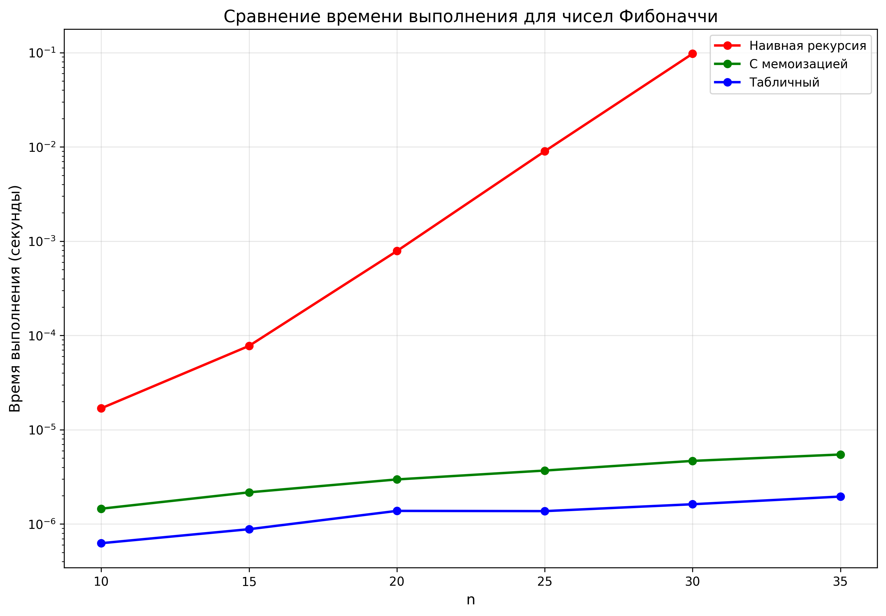
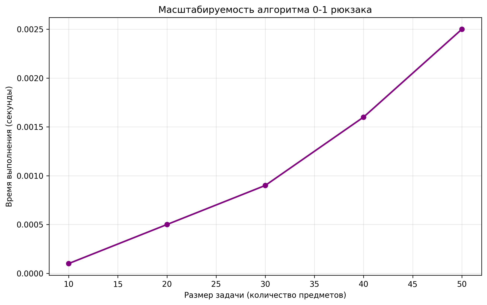
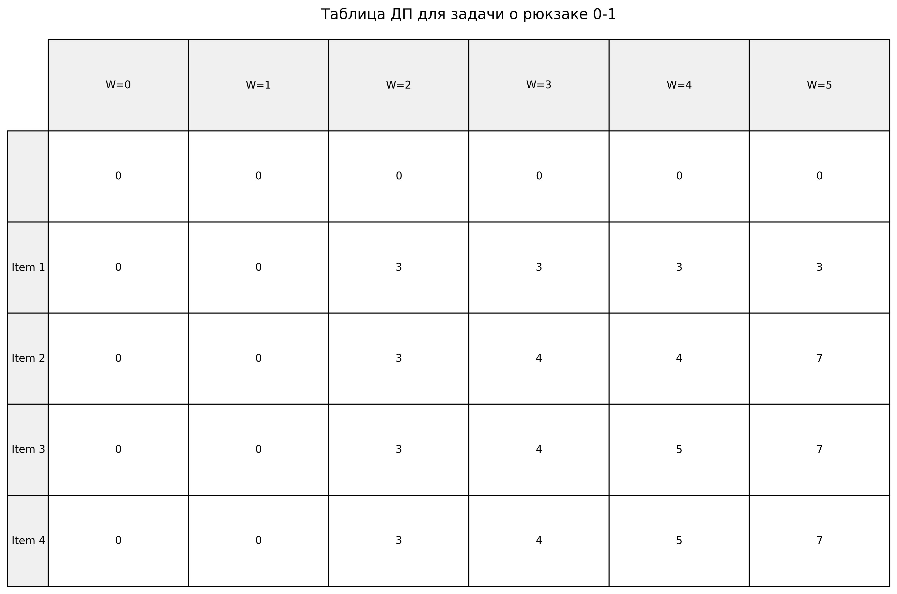
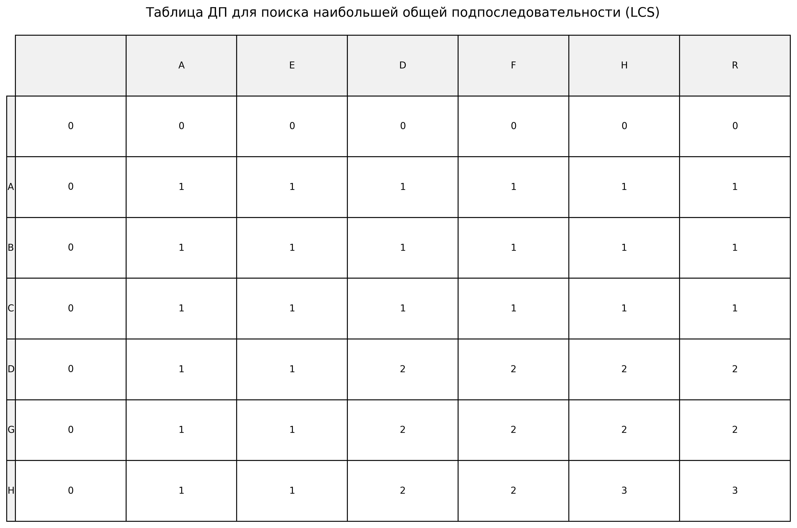

## Отчет к лабораторной работе № 9   

---
**Дата:** 2025-12-01  
**Семестр:** 3 курс 1 полугодие - 5 семестр  
**Группа:** ПИЖ-б-о-23-1  
**Дисциплина:** Анализ сложности алгоритмов   
**Студентка:** Журавлева Софья Витальевна   
**Репозиторий Git:** https://github.com/lookitsssonya/ZhuravlevaSV 
---
## Цель работы:
Изучить метод динамического программирования (ДП) как мощный инструмент для
решения сложных задач путём их разбиения на перекрывающиеся подзадачи. Освоить два основных
подхода к реализации ДП: нисходящий (с мемоизацией) и восходящий (с заполнением таблицы).
Получить практические навыки выявления оптимальной подструктуры задач, построения таблиц ДП и
анализа временной и пространственной сложности алгоритмов.
---
## Теория (кратко):  
**Динамическое программирование (ДП):** Метод решения задач, в которых оптимальное
решение всей задачи зависит от оптимальных решений её перекрывающихся подзадач.    

**Ключевые принципы:**   
* **Оптимальная подструктура:** Оптимальное решение задачи может быть построено из
оптимальных решений её подзадач.
* **Перекрывающиеся подзадачи:** Подзадачи, решения которых используются многократно,
а не один раз.

**Подходы к реализации:**   
* **Нисходящее ДП (Top-Down, с мемоизацией):** Рекурсивное решение с сохранением
(кэшированием) результатов решения подзадач для повторных вычислений.
* **Восходящее ДП (Bottom-Up, табличное):** Итеративное решение, при котором подзадачи
решаются от простейших к сложным, а их результаты заносятся в таблицу (массив).

**Области применения:**  Задачи оптимизации, подсчёта количества способов, нахождения
наиболее вероятной последовательности.    

**Классические задачи:** 
* **Числа Фибоначчи:** Классический пример перекрывающихся подзадач.  
* **Задача о рюкзаке (0-1 Knapsack)):** Выбор предметов с максимальной суммарной
стоимостью без дробления.
* **Наибольшая общая подпоследовательность (LCS):** Поиск самой длинной
последовательности символов, которая является подпоследовательностью двух строк.
* **Расстояние Левенштейна (Редакционное расстояние):** Минимальное количество 
операций вставки, удаления и замены символа, необходимых для превращения одной
строки в другую.   
---
## Практическая часть
### Выполненные задачи:
1. Реализованы классические алгоритмы динамического программирования.
2. Реализованы оба подхода (нисходящий и восходящий) для решения задач
3. Проведен сравнительный анализ эффективности двух подходов.
4. Проанализирована временная и пространственная сложность алгоритмов.
5. Решены практические задачи с применением ДП.
---
### Ключевые фрагменты кода <br></br>
Числа Фибоначчи (наивная рекурсия):       
*dynamic_programming.py:*   
```python
def fibonacci_naive(n: int) -> int:
    if n <= 1:
        return n
    return fibonacci_naive(n - 1) + fibonacci_naive(n - 2)
```
---
Числа Фибоначчи (с мемоизацией):   
*dynamic_programming.py:*
```python
def fibonacci_memo(n: int, memo: Dict[int, int] = None) -> int:
    if memo is None:
        memo = {}

    if n in memo:
        return memo[n]

    if n <= 1:
        return n

    memo[n] = fibonacci_memo(n - 1, memo) + fibonacci_memo(n - 2, memo)
    return memo[n]
```
---
Табличная реализация чисел Фибоначчи:    
*dynamic_programming.py:*
```python
def fibonacci_tabular(n: int) -> int:
    if n <= 1:
        return n

    dp: List[int] = [0] * (n + 1)
    dp[1] = 1

    for i in range(2, n + 1):
        dp[i] = dp[i - 1] + dp[i - 2]

    return dp[n]
```
---
Задача о рюкзаке 0-1:   
*dynamic_programming.py:*
```python
def knapsack_01(
    weights: List[int], values: List[int], capacity: int
) -> Tuple[int, List[int]]:
    n: int = len(weights)
    dp: List[List[int]] = [[0] * (capacity + 1) for _ in range(n + 1)]

    for i in range(1, n + 1):
        for w in range(1, capacity + 1):
            if weights[i - 1] <= w:
                dp[i][w] = max(
                    dp[i - 1][w],
                    values[i - 1] + dp[i - 1][w - weights[i - 1]]
                )
            else:
                dp[i][w] = dp[i - 1][w]

    selected_items: List[int] = []
    w: int = capacity
    for i in range(n, 0, -1):
        if dp[i][w] != dp[i - 1][w]:
            selected_items.append(i - 1)
            w -= weights[i - 1]

    selected_items.reverse()
    return dp[n][capacity], selected_items
```
---
Нахождение наибольшей общей последовательности:    
*dynamic_progrgamming.py:*
```python
def lcs(seq1: str, seq2: str) -> Tuple[int, str]:
    m: int = len(seq1)
    n: int = len(seq2)
    dp: List[List[int]] = [[0] * (n + 1) for _ in range(m + 1)]

    for i in range(1, m + 1):
        for j in range(1, n + 1):
            if seq1[i - 1] == seq2[j - 1]:
                dp[i][j] = dp[i - 1][j - 1] + 1
            else:
                dp[i][j] = max(dp[i - 1][j], dp[i][j - 1])

    lcs_sequence: List[str] = []
    i, j = m, n
    while i > 0 and j > 0:
        if seq1[i - 1] == seq2[j - 1]:
            lcs_sequence.append(seq1[i - 1])
            i -= 1
            j -= 1
        elif dp[i - 1][j] > dp[i][j - 1]:
            i -= 1
        else:
            j -= 1

    lcs_sequence.reverse()
    return dp[m][n], ''.join(lcs_sequence)
```
---
## Результаты выполнения

### Пример работы программы
```bash
ХАРАКТЕРИСТИКИ ПК ДЛЯ ТЕСТИРОВАНИЯ:
- Процессор: Intel Core i5-13420H (2.10 GHz)
- Оперативная память: 16 GB DDR5
- ОС: Windows 11
- Python: 3.11

Сравнение подходов для чисел Фибоначчи:
n       Наивная         Мемоизация      Табличный
-------------------------------------------------------
10      0.000017        0.000001        0.000001
15      0.000078        0.000002        0.000001
20      0.000787        0.000003        0.000001
25      0.009000        0.000004        0.000001
30      0.097538        0.000005        0.000002
35      --              0.000005        0.000002

Сравнение алгоритмов для задачи о рюкзаке:
Предметы (вес, стоимость): [(2, 3), (3, 4), (4, 5), (5, 6)]
Вместимость рюкзака: 5

Рюкзак 0-1 (ДП):
  Максимальная стоимость: 7
  Выбранные предметы: [0, 1]
  Предметы (вес, стоимость): [(2, 3), (3, 4)]
  Суммарный вес: 5
  Время выполнения: 0.000006 сек

Непрерывный рюкзак (жадный):
  Максимальная стоимость: 7.00
  Время выполнения: 0.000001 сек

Разница в стоимости: 0.00

Анализ масштабируемости алгоритмов ДП:
Рюкзак 0-1:
  n=10: 0.0001 сек
  n=20: 0.0002 сек
  n=30: 0.0005 сек
  n=40: 0.0008 сек
  n=50: 0.0012 сек

Решение практических задач:

1. Задача размена монет
   Монеты: [1, 2, 5]
   Сумма: 11
   Минимальное количество монет: 3

2. Наибольшая возрастающая подпоследовательность
   Последовательность: [10, 9, 2, 5, 3, 7, 101, 18]
   Длина LIS: 4
   LIS: [2, 5, 7, 101]
```
---
## Выводы
1. Наивная рекурсивная реализация чисел Фибоначчи имеет экспоненциальную сложность и быстро становится непрактичной (при 
n = 35). В то время как реализация с мемоизацией и применение табличного динамического программирования демонстрируют линейную
сложность и оказываются намного быстрее при больших n. При этом табличный подход имеет еще более заметное преимущество 
перед мемоизацией благодаря отсутствию накладных расходов на рекурсивные вызовы.   

2.  Для задачи о рюкзаке наблюдается квадратичная зависимость времени выполнения от размера задачи (при увеличении количества предметов
время заметно возрастает).   

---
## Ответы на контрольные вопросы
1. **Какие два основных свойства задачи указывают на то, что для ее решения можно применить
динамическое программирование?**   

Две ключевые характеристики задачи, которые указывают на возможность применения динамического программирования:

* Перекрывающиеся подзадачи (Overlapping Subproblems). Это означает, что одна и та же подзадача решается многократно при 
вычислении решения для большей задачи. Динамическое программирование эффективно, так как оно сохраняет (кеширует) результаты 
решения подзадач и повторно использует их вместо того, чтобы вычислять заново.
* Оптимальная подструктура (Optimal Substructure). Это свойство означает, что оптимальное решение всей задачи может быть 
построено из оптимальных решений ее подзадач. Если мы найдем оптимальные решения для всех подзадач, то сможем объединить их, 
чтобы получить оптимальное решение для исходной задачи.
---
2. **В чем разница между нисходящим (top-down) и восходящим (bottom-up) подходами в
динамическом программировании?**   

Разница заключается в порядке решения подзадач:

Нисходящий подход (с мемоизацией):
Начинаем с исходной, самой большой задачи, рекурсивно разбиваем ее на меньшие подзадачи. Если подзадача уже была решена, 
берем результат из кеша. Если нет, вычисляем ее, сохраняем результат в кеше и возвращаем.

Восходящий подход:
Начинаем с самых маленьких, тривиальных подзадач, последовательно вычисляем решения для подзадач, используя уже найденные 
решения для меньших подзадач, результаты сохраняются в таблице, двигаемся "вверх" к решению исходной задачи.    
---
3. **Как задача о рюкзаке 0-1 демонстрирует свойство оптимальной подструктуры?**   

Задача демонстрирует оптимальную подструктуру, потому что оптимальное решение для рюкзака вместимостью W с n предметами 
содержит в себе оптимальные решения для подзадач с меньшим количеством предметов и меньшей вместимостью. 
Например:
Если мы не взяли последний предмет, то оптимальное решение — это оптимальное решение для первых n-1 предметов и той же 
вместимости W.   
Если мы взяли последний предмет, то оптимальное решение — это стоимость этого предмета плюс оптимальное решение для 
первых n-1 предметов и вместимости W - вес предмета.

---
4. **Опишите, как строится и заполняется таблица для решения задачи о наибольшей общей
подпоследовательности (LCS).**    

Строится таблица dp размером (len(X)+1) x (len(Y)+1). Строки соответствуют символам первой последовательности X, 
столбцы — второй Y. Нулевая строка и столбец инициализируются нулями (это "пустые" подпоследовательности).

Заполнение таблицы происходит по строкам по следующему правилу:

* Если X[i-1] == Y[j-1] (символы совпали), то: dp[i][j] = dp[i-1][j-1] + 1
* Иначе (символы не совпали), то: dp[i][j] = max(dp[i-1][j], dp[i][j-1])

В ячейке dp[i][j] хранится длина LCS для префиксов X[0..i-1] и Y[0..j-1]. Ответ на задачу будет находиться в правом 
нижнем углу таблицы dp[len(X)][len(Y)].   
---
5. **Как с помощью динамического программирования можно уменьшить сложность вычисления
чисел Фибоначчи с экспоненциальной до линейной или даже до O(log n)?**  

Экспоненциальная сложность возникает при наивной рекурсии из-за многократного вычисления одних и тех же значений.
Снижение до линейной сложности возможно с помощью мемоизации - рекурсии с кешированием результатов. Перед вычислением проверяется,
не решена ли данная подзадача. Также применим восходящий подход (табличный) - создается массив dp, где dp[0]=0, dp[1]=1, 
и заполняется по порядку до n: dp[i] = dp[i-1] + dp[i-2].

Снижение до логарифмической сложности возможно при использовании возведения матрицы в степень. Числа Фибоначчи можно получить, 
возводя матрицу [[1,1],[1,0]] в n-1 степень. Возведение в степень выполняется за O(log n) операций с помощью алгоритма быстрого 
возведения в степень.
---
## Приложение



