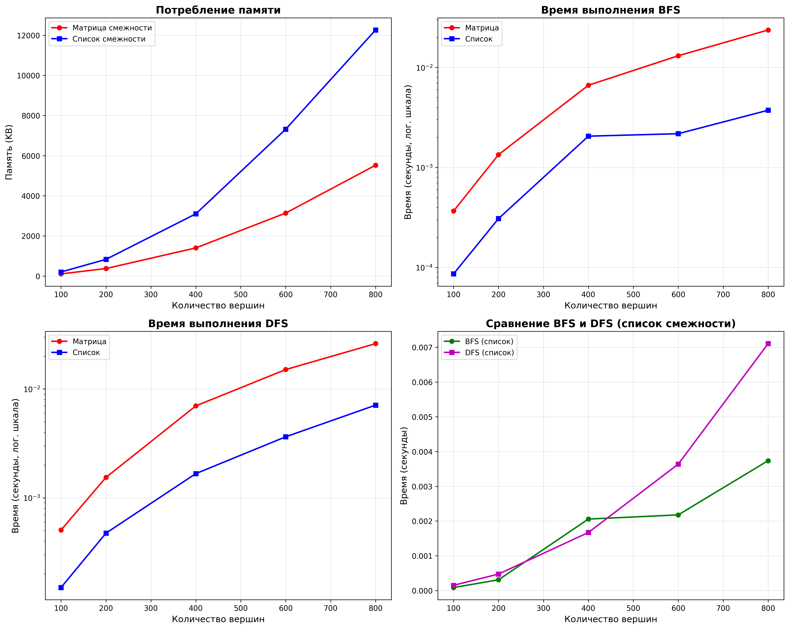
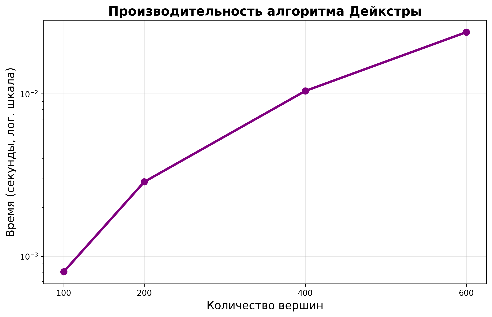

## Отчет к лабораторной работе № 10   

---
**Дата:** 2025-12-01  
**Семестр:** 3 курс 1 полугодие - 5 семестр  
**Группа:** ПИЖ-б-о-23-1  
**Дисциплина:** Анализ сложности алгоритмов   
**Студентка:** Журавлева Софья Витальевна   
**Репозиторий Git:** https://github.com/lookitsssonya/ZhuravlevaSV 

---
## Цель работы:
Изучить основные понятия теории графов и алгоритмы работы с ними. Освоить
представления графов в памяти и основные алгоритмы обхода. Получить практические навыки
реализации алгоритмов на графах и анализа их сложности.   

---
## Теория (кратко):  
**Граф:** Множество вершин (узлов) и рёбер (связей) между ними. Виды: ориентированные/
неориентированные, взвешенные/невзвешенные.    

**Представление графов:**   
* Матрица смежности: O(V²) памяти, быстрая проверка ребра.
* Список смежности: O(V + E) памяти, эффективный обход соседей.

**Обход графов:**   
* Поиск в ширину (BFS): находит кратчайшие пути в невзвешенном графе, сложность O(V + E).
* Поиск в глубину (DFS): обход с возвратом, сложность O(V + E).    

**Алгоритмы на графах:** 
*  Топологическая сортировка: для ориентированных ациклических графов (DAG).  
*  Поиск компонент связности.
*  Алгоритм Дейкстры: кратчайшие пути во взвешенном графе с неотрицательными весами.     
---
## Практическая часть
### Выполненные задачи:
1. Реализованы различные представления графов (матрица смежности, список смежности).
2. Реализованы алгоритмы обхода графов (BFS, DFS).
3. Реализованы алгоритмы поиска кратчайших путей и компонент связности.
4. Проведен сравнительный анализ эффективности разных представлений графов.
5. Решены практические задачи на графах.
---
### Ключевые фрагменты кода <br></br>
Поиск в ширину:       
*graph_traversal.py:*   
```python
@staticmethod
def bfs(graph: Any, start_vertex: str) -> Tuple[Dict[str, int],
                                                Dict[str, Optional[str]]]:
    distances_result: Dict[str, int] = {}
    parents_result: Dict[str, Optional[str]] = {}
    visited: Set[str] = set()
    queue: deque[str] = deque()

    for vertex in graph.get_vertices():
        distances_result[vertex] = -1
        parents_result[vertex] = None

    distances_result[start_vertex] = 0
    queue.append(start_vertex)
    visited.add(start_vertex)

    while queue:
        current_vertex = queue.popleft()
        current_distance = distances_result[current_vertex]

        for neighbor in graph.get_adjacent_vertices(current_vertex):
            if neighbor not in visited:
                visited.add(neighbor)
                distances_result[neighbor] = current_distance + 1
                parents_result[neighbor] = current_vertex
                queue.append(neighbor)

    return distances_result, parents_result
```
---
Поиск в глубину:   
*dgraph_traversal.py:*
```python
@staticmethod
def dfs_recursive(graph: Any, start_vertex: str) -> Dict[str, int]:
    visited_nodes: Set[str] = set()
    discovery_order: Dict[str, int] = {}
    order_counter = [0]

    def dfs_visit(vertex: str) -> None:
        visited_nodes.add(vertex)
        discovery_order[vertex] = order_counter[0]
        order_counter[0] += 1

        for neighbor in graph.get_adjacent_vertices(vertex):
            if neighbor not in visited_nodes:
                dfs_visit(neighbor)

    dfs_visit(start_vertex)
    return discovery_order
```
---
Алгоритм Дейкстры:    
*shortest_path.py:*
```python
@staticmethod
def dijkstra_adjacency_list(
    graph: AdjacencyList, start_vertex: str
) -> Tuple[Dict[str, float], Dict[str, Optional[str]]]:
    distances: Dict[str, float] = {}
    parents: Dict[str, Optional[str]] = {}

    for vertex in graph.get_vertices():
        distances[vertex] = float('inf')
        parents[vertex] = None

    distances[start_vertex] = 0

    priority_queue: List[Tuple[float, str]] = []
    heapq.heappush(priority_queue, (0, start_vertex))

    while priority_queue:
        current_distance, current_vertex = heapq.heappop(priority_queue)

        if current_distance > distances[current_vertex]:
            continue

        for neighbor in graph.get_adjacent_vertices(current_vertex):
            edge_weight = graph.get_edge_weight(current_vertex, neighbor)
            if edge_weight is None:
                continue

            new_distance = current_distance + edge_weight

            if new_distance < distances[neighbor]:
                distances[neighbor] = new_distance
                parents[neighbor] = current_vertex
                heapq.heappush(priority_queue, (new_distance, neighbor))

    return distances, parents
```
---
Топологическая сортировка:   
*shortest_path.py:*
```python
@staticmethod
def topological_sort_adjacency_list(graph: AdjacencyList) -> List[str]:
    if not graph.directed:
        raise ValueError(
            'Данная сортировка применима только к ориентированным графам'
        )

    in_degree: Dict[str, int] = {}
    result: List[str] = []
    queue: List[str] = []

    for vertex in graph.get_vertices():
        in_degree[vertex] = 0

    for vertex in graph.get_vertices():
        for neighbor in graph.get_adjacent_vertices(vertex):
            in_degree[neighbor] += 1

    for vertex, degree in in_degree.items():
        if degree == 0:
            queue.append(vertex)

    while queue:
        vertex = queue.pop(0)
        result.append(vertex)

        for neighbor in graph.get_adjacent_vertices(vertex):
            in_degree[neighbor] -= 1
            if in_degree[neighbor] == 0:
                queue.append(neighbor)

    if len(result) != len(graph.get_vertices()):
        raise ValueError(
            'Граф содержит циклы, топологическая сортировка невозможна'
        )

    return result
```
---
## Результаты выполнения

### Пример работы программы
```bash
ХАРАКТЕРИСТИКИ ПК ДЛЯ ТЕСТИРОВАНИЯ:
- Процессор: Intel Core i5-13420H (2.10 GHz)
- Оперативная память: 16 GB DDR5
- ОС: Windows 11
- Python: 3.11

  Размер |      Память (KB)      |    BFS время (сек)    |    DFS время (сек)   
         |    Матрица     Список |    Матрица     Список |    Матрица     Список
---------------------------------------------------------------------------------
     100 |     107.79     201.69 |   0.000367   0.000086 |   0.000506   0.000150
     200 |     374.10     831.76 |   0.001344   0.000308 |   0.001542   0.000474
     400 |    1402.21    3099.47 |   0.006643   0.002057 |   0.006996   0.001670
     600 |    3138.99    7318.64 |   0.013104   0.002177 |   0.015079   0.003638
     800 |    5523.82   12262.37 |   0.023723   0.003737 |   0.026105   0.007105

Алгоритм Дейкстры:
Вершины | Время (сек)
-------------------------
    100 | 0.000804
    200 | 0.002873
    400 | 0.010416
    600 | 0.023957

Сложность: O((V + E) log V)

1. Определение связности сети
Сеть содержит 3 компонент(ы) связности:
  Компонента 1: ['A', 'B', 'C']
  Компонента 2: ['D', 'E']
  Компонента 3: ['F', 'G']

2. Топологическая сортировка
Порядок выполнения задач:
  1. Задача A
  2. Задача B
  3. Задача C
  4. Задача D
  5. Задача E
  6. Задача F

3. Кратчайший путь в сети
Кратчайший путь от A1 до A3: A1 -> A2 -> A3
Время в пути: 15

4. Решение лабиринта
Лабиринт 5x5
Путь от (0, 0) до (4, 4) найден
Длина пути: 9 шагов
```
---
## Выводы
1. Сравнительный анализ эффективности различных представлений графов показал четкую зависимость производительности от 
структуры данных. Матрица смежности демонстрирует квадратичный рост потребления памяти O(V²), что делает ее непрактичной 
для работы с крупными разреженными графами. Список смежности, в свою очередь, обладает линейной сложностью по памяти O(V + E) 
и показывает значительно лучшую производительность при обходе графа, особенно для разреженных структур.   

2.  Поиск в ширину (BFS) идеально подходит для задач нахождения кратчайшего пути в невзвешенных графах и анализа компонент 
связности, гарантируя оптимальность решения. Поиск в глубину (DFS), напротив, более эффективен для задач проверки ацикличности, 
топологической сортировки и анализа структур с глубокой вложенностью, хотя и не обеспечивает кратчайший путь. Алгоритм Дейкстры 
эффективен для работы со взвешенными графами, показывая хорошую производительность O((V+E)logV) при решении задач маршрутизации 
и планирования.    

---
## Ответы на контрольные вопросы
1. **В чем разница между представлением графа в виде матрицы смежности и списка смежности?
Сравните их по потреблению памяти и сложности операций.**   

Матрица смежности представляет граф в виде двумерного массива размером V×V, где элемент matrix[i][j] указывает на наличие 
и вес ребра между вершинами i и j. Список смежности хранит для каждой вершины список смежных с ней вершин.

Потребление памяти:

* Матрица смежности: O(V²) - всегда занимает квадратичный объем памяти.   
* Список смежности: O(V + E) - зависит от количества вершин и рёбер.   

Сложность операций:
* Добавление ребра: O(1) в обоих случаях.
* Проверка наличия ребра: O(1) для матрицы, O(deg(v)) для списка.
* Обход соседей вершины: O(V) для матрицы, O(deg(v)) для списка.
* BFS/DFS: O(V²) для матрицы, O(V + E) для списка.

---
2. **Опишите алгоритм поиска в ширину (BFS). Для решения каких задач он применяется?**   

Ключевая особенность алгоритма поиска в ширину — постепенное исследование всех узлов на одном уровне глубины перед 
переходом к следующему. обход начинается с посещения определённой вершины (для обхода всего графа часто выбирается 
произвольная вершина). Затем алгоритм посещает соседей этой вершины, за ними — соседей соседей, и так далее.  BFS применяется 
для решения задач, где важно найти кратчайший путь в невзвешенном графе. Под кратчайшим путём подразумевается путь, 
содержащий наименьшее число рёбер.

---
3. **Чем поиск в глубину (DFS) отличается от BFS? Какие дополнительные задачи (например, проверка
на ацикличность) можно решить с помощью DFS?**   

DFS (поиск в глубину) и BFS (поиск в ширину) отличаются подходом к обходу графов. DFS исследует граф «вглубь», прежде чем 
возвращаться и исследовать альтернативные пути, а BFS — «по уровням».   

С помощью DFS можно решить, например:
* Проверку графа на ацикличность — граф является ациклическим, когда во время выполнения поиска в глубину не встречаются 
обратные ссылки (или нисходящие).
* Топологическую сортировку — запустить серию поисков в глубину, чтобы обойти все вершины графа, и отсортировать вершины 
по времени выхода по убыванию — это и будет ответом.
* Поиск компонент сильной связности — сначала сделать топологическую сортировку, потом транспонировать граф и провести 
снова серию поисков в глубину в порядке, определяемом топологической сортировкой. Каждое дерево поиска — сильносвязная 
компонента.

---
4. **Как алгоритм Дейкстры находит кратчайшие пути во взвешенном графе? Почему он не работает с
отрицательными весами ребер?**    

Алгоритм Дейкстры находит кратчайшие пути от стартовой вершины до всех остальных во взвешенном графе с неотрицательными весами. 
Он использует жадную стратегию с приоритетной очередью, на каждом шаге выбирая вершину с минимальным текущим расстоянием.  

Причины неработоспособности с отрицательными весами:
* Жадный выбор становится неоптимальным - вершина, выбранная как имеющая минимальное расстояние, может позже получить 
еще меньшее расстояние через ребро с отрицательным весом.
* Отсутствие механизма перерасчета уже обработанных вершин.
* Возможность образования циклов с отрицательным суммарным весом, где путь можно бесконечно улучшать.

---
5. **Что такое топологическая сортировка и для каких графов она применима? Приведите пример
задачи, где она используется.**  

Топологическая сортировка — это линейное упорядочивание вершин ориентированного ациклического графа, при котором для 
каждого ребра (u → v) вершина u предшествует вершине v в полученной последовательности. Если одна вершина зависит от 
другой (например, одна задача должна быть выполнена до другой), то в топологическом порядке зависимая вершина будет 
стоять позже. Топологическая сортировка применима только к ориентированным ациклическим графам. Если в графе есть цикл 
(например, A зависит от B, B от C, а C от A), то корректная линейная зависимость невозможна, и топологическую сортировку 
построить нельзя.    
Задачи, в которых используется топологическая сортировка: планирование задач и процессов, построение учебного плана и т.д.

---
## Приложение



