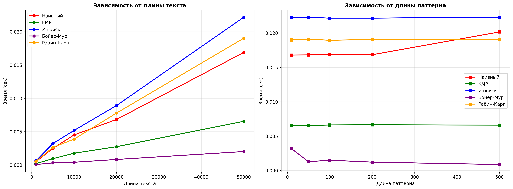
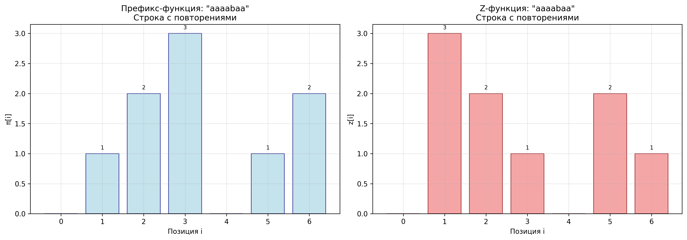
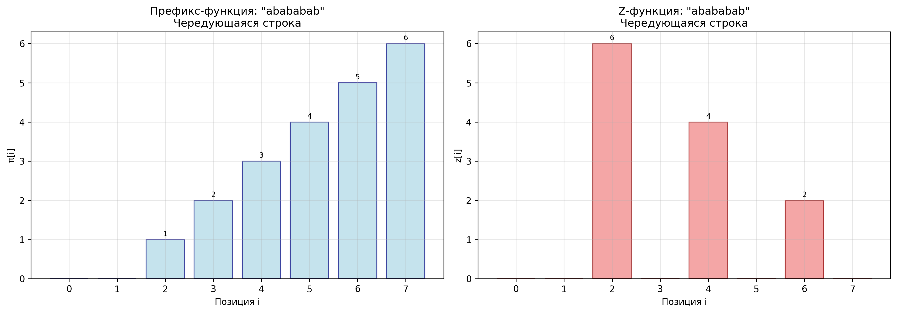
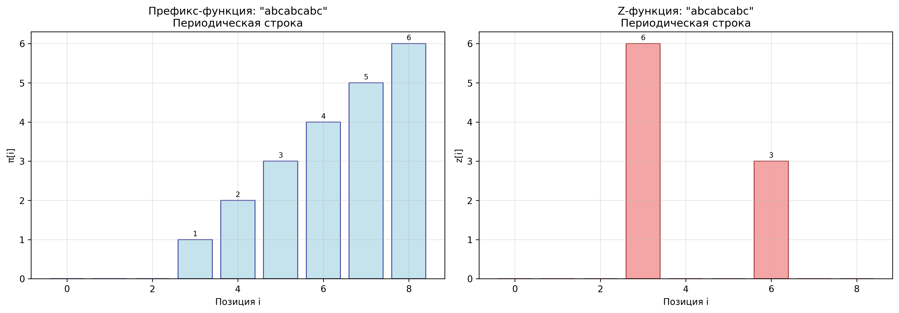

## Отчет к лабораторной работе № 11   

---
**Дата:** 2025-12-01  
**Семестр:** 3 курс 1 полугодие - 5 семестр  
**Группа:** ПИЖ-б-о-23-1  
**Дисциплина:** Анализ сложности алгоритмов   
**Студентка:** Журавлева Софья Витальевна   
**Репозиторий Git:** https://github.com/lookitsssonya/ZhuravlevaSV 
---
## Цель работы:
Изучить специализированные алгоритмы для эффективной работы со строками. Освоить
методы поиска подстрок, вычисление префикс-функции и Z-функции. Получить практические навыки
реализации и анализа алгоритмов обработки строк, исследовать их производительность.  
---
## Теория (кратко):  
**Префикс-функция:** Для строки S длиной n - массив π[0..n-1], где π[i] - длина наибольшего
собственного префикса, который является суффиксом подстроки S[0..i]. Сложность вычисления:
O(n).    

**Алгоритм Кнута-Морриса-Пратта (KMP):** Эффективный алгоритм поиска подстроки,
использующий префикс-функцию. Сложность: O(n + m).  

**Z-функция:** Для строки S длиной n - массив z[0..n-1], где z[i] - длина наибольшего общего
префикса строки S и суффикса S[i..n-1]. Сложность вычисления: O(n).    

**Поиск подстроки:** Помимо KMP существуют алгоритмы Бойера-Мура, Рабина-Карпа, каждый со
своими особенностями и областью применения.        
---
## Практическая часть
### Выполненные задачи:
1. Реализовано вычисление префикс-функции для строки.
2. Реализован алгоритм Кнута-Морриса-Пратта для поиска подстроки.
3. Реализовано вычисление Z-функции.
4. Реализован один из дополнительных алгоритмов поиска подстроки.
5. Проведен сравнительный анализ эффективности алгоритмов на различных данных.
---
### Ключевые фрагменты кода <br></br>
Алгоритм Кнута-Морриса-Пратта (KMP):       
*kmp_search.py:*   
```python
def kmp_search(text: str, pattern: str) -> List[int]:
    if not pattern:
        return []

    n = len(text)
    m = len(pattern)

    if m > n:
        return []

    pi = compute_prefix_function(pattern)
    occurrences = []

    j = 0

    for i in range(n):
        while j > 0 and text[i] != pattern[j]:
            j = pi[j - 1]

        if text[i] == pattern[j]:
            j += 1

        if j == m:
            occurrences.append(i - m + 1)
            j = pi[j - 1]

    return occurrences
```
---
Алгорит Бойера-Мура:   
*boyer_moore.py:*
```python
def boyer_moore_search(text: str, pattern: str) -> List[int]:
    if not pattern:
        return []

    n = len(text)
    m = len(pattern)

    if m > n:
        return []

    bad_char = {}
    for i in range(m - 1):
        bad_char[pattern[i]] = m - i - 1

    default_shift = m

    occurrences = []
    i = 0

    while i <= n - m:
        j = m - 1

        while j >= 0 and pattern[j] == text[i + j]:
            j -= 1

        if j < 0:
            occurrences.append(i)
            i += 1
        else:
            shift = bad_char.get(text[i + j], default_shift)

            i += max(1, shift - (m - 1 - j))

    return occurrences
```
---
Алгорит Рабина-Карпа:    
*rabin_karp.py:*
```python
def rabin_karp_search(text: str, pattern: str, prime: int = 101) -> List[int]:
    if not pattern:
        return []

    n = len(text)
    m = len(pattern)

    if m > n:
        return []

    occurrences = []

    pattern_hash = 0
    text_hash = 0
    h = 1

    d = 256

    for i in range(m - 1):
        h = (h * d) % prime

    for i in range(m):
        pattern_hash = (d * pattern_hash + ord(pattern[i])) % prime
        text_hash = (d * text_hash + ord(text[i])) % prime

    for i in range(n - m + 1):
        if pattern_hash == text_hash:
            match = True
            for j in range(m):
                if text[i + j] != pattern[j]:
                    match = False
                    break

            if match:
                occurrences.append(i)

        if i < n - m:
            text_hash = (
                d * (text_hash - ord(text[i]) * h) + ord(text[i + m])
            ) % prime

            if text_hash < 0:
                text_hash += prime

    return occurrences
```
---
Префикс-функция:   
*prefix_function.py:*
```python
def compute_prefix_function(text: str) -> List[int]:
    n = len(text)
    pi = [0] * n

    for i in range(1, n):
        j = pi[i - 1]

        while j > 0 and text[i] != text[j]:
            j = pi[j - 1]

        if text[i] == text[j]:
            j += 1

        pi[i] = j

    return pi
```
---
Z-функция:    
*z_function.py:*
```python
def compute_z_function(text: str) -> List[int]:
    n = len(text)
    if n == 0:
        return []

    z = [0] * n
    left = 0
    right = 0

    for i in range(1, n):
        if i <= right:
            z[i] = min(right - i + 1, z[i - left])

        while i + z[i] < n and text[z[i]] == text[i + z[i]]:
            z[i] += 1

        if i + z[i] - 1 > right:
            left = i
            right = i + z[i] - 1

    return z
```
---
## Результаты выполнения

### Пример работы программы
```bash
ХАРАКТЕРИСТИКИ ПК ДЛЯ ТЕСТИРОВАНИЯ:
- Процессор: Intel Core i5-13420H (2.10 GHz)
- Оперативная память: 16 GB DDR5
- ОС: Windows 11
- Python: 3.11

Префикс-функции и Z-функции

 'abcabcabc':
Префикс-функция: [0, 0, 0, 1, 2, 3, 4, 5, 6]
Z-функция:       [0, 0, 0, 6, 0, 0, 3, 0, 0]
Период (по префикс-функции): 3
Период (по Z-функции): 3

 'aaaabaa':
Префикс-функция: [0, 1, 2, 3, 0, 1, 2]
Z-функция:       [0, 3, 2, 1, 0, 2, 1]

 'abababab':
Префикс-функция: [0, 0, 1, 2, 3, 4, 5, 6]
Z-функция:       [0, 0, 6, 0, 4, 0, 2, 0]
Период (по префикс-функции): 2
Период (по Z-функции): 2

Тестирование на разных длинах текста

Длина текста: 1000
    Наивный: 0.000217 сек
    KMP: 0.000081 сек
    Z-поиск: 0.000271 сек
    Бойер-Мур: 0.000031 сек
    Рабин-Карп: 0.000158 сек

Длина текста: 5000
    Наивный: 0.000706 сек
    KMP: 0.000269 сек
    Z-поиск: 0.000944 сек
    Бойер-Мур: 0.000080 сек
    Рабин-Карп: 0.000800 сек

Длина текста: 10000
    Наивный: 0.001295 сек
    KMP: 0.000630 сек
    Z-поиск: 0.001836 сек
    Бойер-Мур: 0.000157 сек
    Рабин-Карп: 0.001593 сек

Длина текста: 20000
    Наивный: 0.002990 сек
    KMP: 0.001014 сек
    Z-поиск: 0.003597 сек
    Бойер-Мур: 0.000367 сек
    Рабин-Карп: 0.002958 сек

Длина текста: 50000
    Наивный: 0.006846 сек
    KMP: 0.002639 сек
    Z-поиск: 0.008751 сек
    Бойер-Мур: 0.000814 сек
    Рабин-Карп: 0.007875 сек

Тестирование на разных длинах паттерна

Длина паттерна: 10
    Наивный: 0.006570 сек
    KMP: 0.002525 сек
    Z-поиск: 0.008782 сек
    Бойер-Мур: 0.001380 сек
    Рабин-Карп: 0.007324 сек

Длина паттерна: 50
    Наивный: 0.006831 сек
    KMP: 0.002520 сек
    Z-поиск: 0.008982 сек
    Бойер-Мур: 0.000525 сек
    Рабин-Карп: 0.008543 сек

Длина паттерна: 100
    Наивный: 0.006553 сек
    KMP: 0.002581 сек
    Z-поиск: 0.008692 сек
    Бойер-Мур: 0.001173 сек
    Рабин-Карп: 0.007630 сек

Длина паттерна: 200
    Наивный: 0.006187 сек
    KMP: 0.002556 сек
    Z-поиск: 0.008927 сек
    Бойер-Мур: 0.000363 сек
    Рабин-Карп: 0.008769 сек

Длина паттерна: 500
    Наивный: 0.007732 сек
    KMP: 0.002557 сек
    Z-поиск: 0.008606 сек
    Бойер-Мур: 0.000622 сек
    Рабин-Карп: 0.007552 сек

Зависимость от длины текста:
  Бойер-Мур: 0.000290 сек
  KMP: 0.000927 сек
  Наивный: 0.002411 сек
  Рабин-Карп: 0.002677 сек
  Z-поиск: 0.003080 сек

Зависимость от длины паттерна:
  Бойер-Мур: 0.000813 сек
  KMP: 0.002548 сек
  Наивный: 0.006775 сек
  Рабин-Карп: 0.007964 сек
  Z-поиск: 0.008798 сек

Анализ результатов:
   - Самый быстрый алгоритм для поиска в тексте: Бойер-Мур
   - Самый быстрый алгоритм для разных паттернов: Бойер-Мур
   - Бойер-Мур быстрее наивного алгоритма в 8.3 раз

Решение практических задач

1. Поиск всех вхождений паттерна в тексте
Найти все вхождения подстроки 'abc' в строке 'ababcabcabababd'
Результат: Найдено 2 вхождений на позициях: [2, 5]

2. Найти период строки
Найти период строки 'abcabcabc'
Результат: Период строки 3. Строка состоит из 3 повторений 'abc'

3. Проверка циклического сдвига строк
Проверить, является ли 'cdeab' циклическим сдвигом 'abcde'
Результат: 'cdeab' является циклическим сдвигом 'abcde'

4. Поиск самого длинного палиндрома в строке
Найти самый длинный палиндром в строке 'babad'
Результат: Самый длинный палиндром: 'bab' (длина: 3)

5. Поиск самой длинной общей подстроки
Найти самую длинную общую подстроку в строках: ['flower', 'flow', 'flight']
Результат: Самая длинная общая подстрока: 'fl' (длина: 2)

6. Подсчет количества различных подстрок
Подсчитать количество различных подстрок в строке 'aba'
Результат: В строке 'aba' содержится 5 различных подстрок
```
---
## Выводы
1. Алгоритм Бойера-Мура продемонстрировал наилучшие результаты в большинстве тестовых сценариев, особенно при работе с 
большими объемами данных и длинными поисковыми паттернами. Его эффективность объясняется использованием эвристики плохого 
символа, которая позволяет осуществлять большие прыжки по тексту при несовпадениях. Алгоритмы KMP и Z-поиск показали 
сопоставимую высокую производительность, обеспечивая стабильность работы в различных условиях. 
Наивный поиск оказался наименее эффективным, особенно на больших объемах данных.  

2. При увеличении длины текста алгоритм Бойера-Мура показал наилучшую масштабируемость, в то время как наивный алгоритм 
демонстрировал экспоненциальный рост времени выполнения. При увеличении длины паттерна, наилучшую масштабируемость показал
также Бойер-Мур, особенно эффективный при работе с длинными образцами для поиска. KMP и Z-поиск сохраняли стабильную 
производительность независимо от длины паттерна благодаря предварительной обработке данных.  

---
## Ответы на контрольные вопросы
1. **Что такое префикс-функция строки? Как она используется в алгоритме Кнута-Морриса-Пратта
 (KMP)?**   

Префикс-функция строки pi для строки S длиной n - это массив pi той же длины, где pi[i] равно длине самого длинного 
собственного префикса строки S[0...i], который также является суффиксом этой же подстроки S[0...i].   

Алгоритм KMP предназначен для эффективного поиска вхождения подстроки P (паттерн) в тексте T. Префикс-функция pi 
вычисляется для подстроки P. Она позволяет избежать избыточных сравнений символов при совпадении части паттерна с текстом.

---
2. **В чем основное преимущество алгоритма KMP перед наивным алгоритмом поиска подстроки?
Проиллюстрируйте на примере.**   

Основное преимущество: KMP избегает многократного пересмотра одних и тех же символов текста. Наивный алгоритм при каждом 
несовпадении сдвигает паттерн на 1 позицию и начинает сравнение заново, что может приводить к O(mn) сравнениям, где 
n - длина текста, m - длина паттерна. KMP, используя префикс-функцию, сдвигает паттерн, гарантируя, что каждый символ 
текста будет рассмотрен не более одного раза (или очень ограниченное число раз, в зависимости от точной реализации и анализа).  

Текст: "AAAAB"
Образец: "AAA"

Наивный алгоритм: 9 сравнений (многократно проверяет одни и те же 'A')   
KMP: 5 сравнений (движется только вперед по тексту)

---
3. **Опишите, что такое Z-функция строки. Как с ее помощью можно решить задачу поиска
подстроки?**   

Z-функция строки — это массив, каждый элемент которого равен длине максимальной подстроки, начинающейся с определённой 
позиции и равной префиксу исходной строки. Иными словами, Z-функция — это вектор длин наибольшего общего префикса строки 
с её суффиксом. 

Чтобы найти подстроку в строке с помощью Z-функции, нужно выполнить следующие шаги:
* Определить длину текста (n) и образца (m).
* Образовать строку s = pattern + # + text, где # — символ, не встречающийся ни в text, ни в pattern.
* Вычислить Z-функцию от этой строки.
* В полученном массиве в позициях, в которых значение Z-функции равно длине образца, начинается подстрока, совпадающая с pattern.

---
4. **В чем заключается идея алгоритма Бойера-Мура? Какие эвристики он использует для ускорения
поиска?**    

Идея алгоритма Бойера-Мура заключается в том, чтобы не просто сравнивать шаблон с текстом, а эффективно избегать 
бесполезных сравнений. 

Для ускорения поиска алгоритм использует две эвристики:
* Эвристика плохого символа. Если при сравнении шаблона с текстом найден символ, который не совпадает с соответствующим 
символом шаблона, то шаблон сдвигают так, чтобы этот «плохой» символ выровнялся с последним его вхождением в шаблоне. 
Если его нет — можно двигаться дальше. Это снижает количество ненужных сравнений, особенно если в тексте часто встречаются 
«лишние» символы.
* Эвристика хорошего суффикса. Если часть шаблона уже совпала с текстом, но дальше произошёл сбой, можно поискать, 
встречается ли совпавший суффикс где-то ещё в шаблоне. Если да — шаблон двигают туда. Если нет — можно сделать прыжок 
на всю длину совпадения.   

---
5. **Для каких практических задач, помимо поиска подстроки, могут применяться префикс- и Z
функции (например, поиск периода строки)?**  

* Поиск всех вхождений образца в текст
* Нахождение количества различных подстрок в строке
* Сжатие строки
* Разбиение строки на палиндромы и т.д.

---
## Приложение



